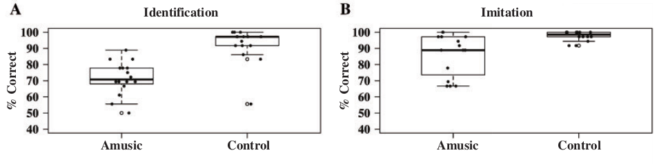
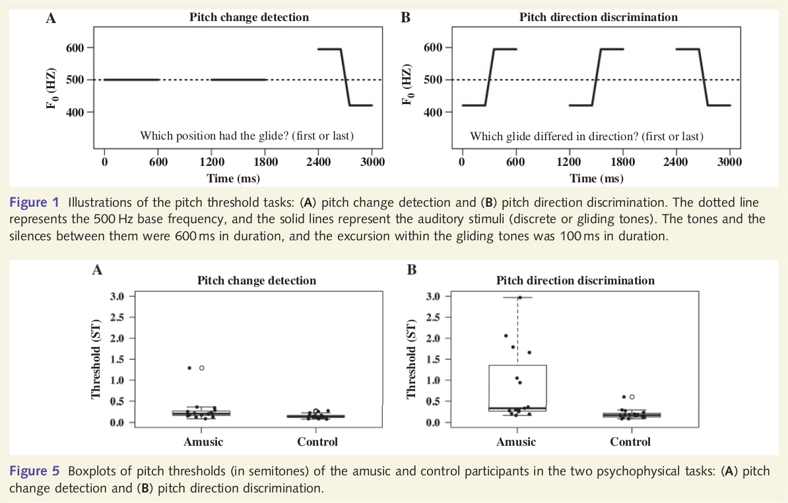

# General notes

**I Couldn't find the following papers:**

- Lerdahl, F. (2001). Tonal pitch space. Cambridge, MA: MIT Press. [Essentially an expansion of the 1988 paper.]

- Shepard, R. N. (1982). Structural representations of musical pitch. In D. Deutsch (Ed.), Psychology of Music (pp. 343–390). New York: Academic Press.

What does the asterisk near some of the resources on the reading list mean?

# Disorders

## Intonation processing in congenital amusia: discrimination, identification and imitation (Liu et al. 2010)

### Experiment

16 amusics and 16 matched control participants.

#### Statement-question discrimination for speech, gliding tones, and nonsense speech (3 tasks)

Dependent variable: statement-statement / statement-question / question-statement / question-question pairs.

Independent variable: correctness in same or different task.

#### Statement/question identification and imitation (2 tasks)

Dependent variable: spoken statement/question stimuli.

Independent variable: correctness in identifying (statement or question) and imitation.

#### Pitch change detection and direction discrimination (2 tasks)

Dependent variable: 3 items, the first or the last is different.

Independent variable: correctness in identifying the unique item.

### Summary

Amusics fail to discriminate interval direction, and therefore have difficulties in telling statement from question.
Shows a common mechanism for music and speech processing.

# Pitch perception

## Contour, interval, and pitch recognition in memory for melodies (Dowling and Fujitani, 1971)

### Experiment 1

Dependent variables:

1. Comparison melody transposed or in the same ("standard") scale.
1. Comparison melody is (a) the same or completely different melody (b) same melody or different contour and (c) only same contour or completely different melody.

Independent variable: ability to distinguish melodies according to tasks (a), (b) and (c) above.

### Experiment 2

Dependent variable: distorted changes in familiar melodies.

Independent variable: ability to identify the melody.

### Summary

When there is no transposition short term memory of a melody uses mainly the intervals and knowledge of the scale. However, when transposed, participants use contour memory more than intervals memory.

For long term memory, participants rely on intervals much more than on contour, although recognition by contour is still above chance level.

## Scale and Contour: Two Components of a Theory of Memory for Melodies (Dowling, 1978)

Extension for Dowling and Fujitani 1971. Two different mechanisms to memorize melodies: scale based and the contour based.

Dependent variable: (a standard / probe melody followed by) one of the following stimuli.

1. Transposition
2. Tonal answer with same contour and different intervals (and transposition).
3. Atonal melody with same contour.
4. Random melody.

Independent variable: the ability to identify the melody as same or different.

## Are scale degree qualia a consequence of statistical learning? (Huron, 2006)

### Experiment

Participants describe, in words, the _qualia_ (a quality or property as perceived or experienced by a person) of each semitone compared to known tonic.

Dependent variable: semitone.
Independent variable: qualia.

### Statistical research

Generates a markov matrix for melody notes from a corpus.

### Correlation between qualia and statistical research

Most qualia are represented in the statistical properties of each semitone.

## Tracing the Dynamic Changes in Perceived Tonal Organization in a Spatial Representation of Musical Keys (Krumhansl and Kesler, 1982)

3 objectives:

1. Profiles for notes within keys -> Map of keys by profiles correlations.
2. Distance of chords to different keys.
3. Resolving key (including modulations) from sequence of chords by projecting over the map of keys.

## Cognitive foundations of musical pitch (Krumhansl, 1990)

How do we perceived a key? Can we use pattern-matching to tonal hierarchies?

A proposed algorithm is based on profiles matching and behaves better than other algorithms in the field, suggesting that we determine the key by pattern-matching to tonal profiles.

**Q: The algorithm performance is not compared to human performance, only to known algorithms. The fact that it perform better doesn't mean that it behaves similar to humans.**

# Absolute pitch

## Absolute memory for musical pitch: evidence from the production of learned melodies (Levitin, 1994)

High percentage of people (much higher than the percentage of people with AP) can sing a familiar melodies in tune, suggesting that "some degree of absolute memory representation exists in the general population". The author claim that AP provides the ability to _lable_ pitches, while the ability to memorize and recall pitches (aka _pitch memory_) is more widespread.

### Experiment

Dependent variable: the songs the participants where asked to sing.
Independent variable: the pitch distance (in semitones) of the singing from the original melodies.

## Genetic correlates of musical pitch recognition in humans (Draya et al. 2001)

### Experiment

Dependent variables:

- The participant(s) are monozygotic (identical) twins or not.
- Distorted or non-distorted popular melody was played.

Independent variable: the ability to tell if the melody was distorted or not.

### Summary

Hight correlation between the identical twin responses, compared to the dizygotic twins, suggests that there is a genetic component for the memory of pitch.

## Absolute Pitch as a Learned Phenomenon: Evidence Consistent with the Hick-Hyman Law (Simpson & Huron, 1994)

Experiment done with AP participants suggests that it is (at least partly) learned ability, by showing high correlation between response time and occurrences of pitch classes in western culture corpora.

**No experiment**. The authors use that the results from another experiment (Miyazaki, 1989) correlates with data.
