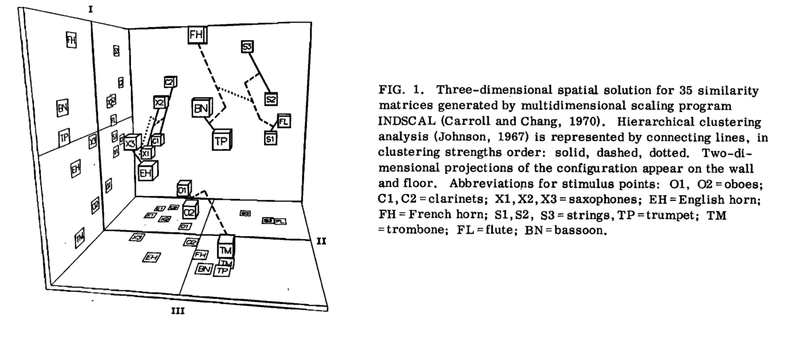
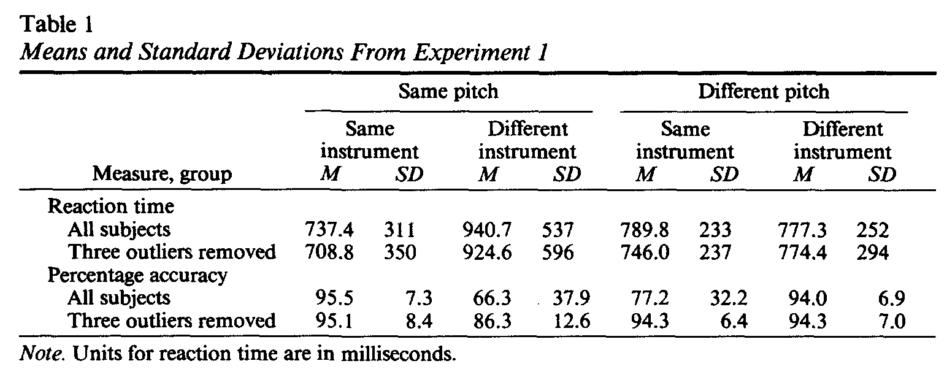
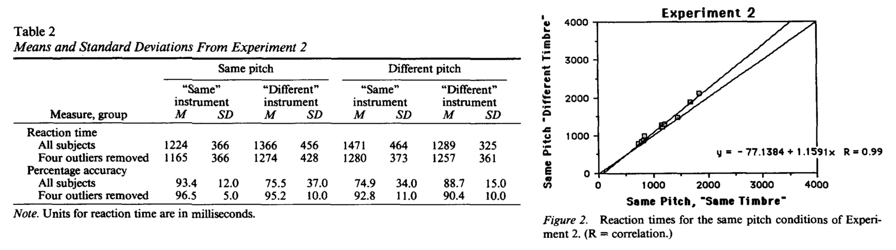
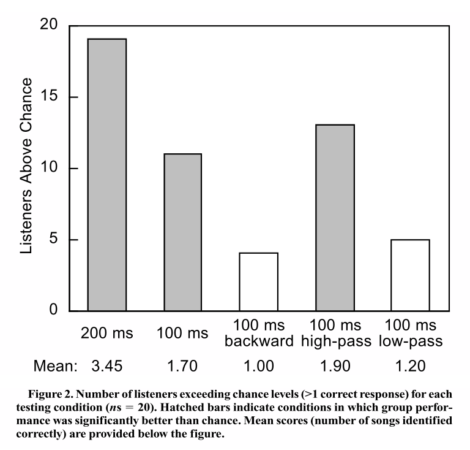
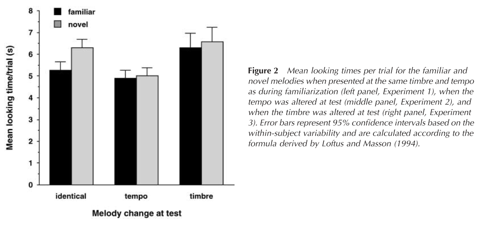
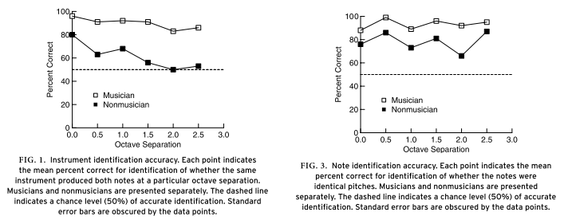
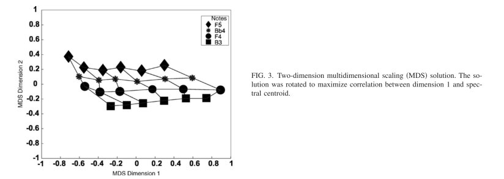

## Pratt & Doak 1976

**A subjective rating scale for timbre**

Suggested subjective 3 dimensional rating scale for timbre: Dull/Brilliant, Cold/Warm, Pure/Rich.

### Experiment 1

**Independent variable:** name of instruments family (woodwind / strings / brass / "combination of all three").
**Dependent variable:** 6 words to describe the family, from a words bank.

7 words reported much more times than the rest. Authors decided that some of them could be merged and some could be dropped out, to get 3 "most important" words to describe timbre. Authors added their antonyms to get the suggested subjective scale.

### Experiment 2

**Independent variable:** 6 synthesized tones.
**Dependent variable:** subjective rating on the proposed scale.

### Criticism

On experiment 1, only the "combination of all three" column was used, although it is the most vague. The word "Nasal" was chosen to describe woodwind instruments more than any other word, for any other family(!) but it was ignored -> too biased.

## Grey 1977

**Multidimensional perceptual scaling of musical timbres**

Suggested three dimensional scale for timbre, were each axis was interpreted from the result of multidimensional scaling technique and hierarchic clustering analysis of similarity between instrument pairs.

### Experiment 1

**Independent variable:** a pair of synthesized instrument sounds.
**Dependent variable:** reported similarity between the sounds on a 1 to 30 scale.

Two techniques were used to transform the data:

- Dimensionality reduction to 3 dimensions. These were later interpreted to be "spectral energy distribution", "spectral flux", and "presence of high-freq low-amplitude often in-harmonic energy".
- Hierarchic clustering.

### Experiment 2

**Independent variable:** synthesized sound from experiment 1.
**Dependent variable:** the ability to label the sound correctly (after familiarizing with all of the sounds).

Producing confusion matrix and comparing it to the experiment 1 results.

### Criticism

On experiment 1 no measurement / experiment was done to explain the interpretations of the axes, only qualitative observations.
Generally, the first 2 points of criticism for McAdams.

## Wessel 1979 _Didn't read, but it's important! TODO_

**Timbre Space as a Musical Control Structure**

## Crowder 1989

**Imagery for musical timbre**

It's easy to acknowledge that two tones have the same pitch when they are played on the same instrument, but harder when played on different instruments, even if one of the instrument timbres is imaginary. This doesn't apply for different pitches (the task is not simpler when the timbre is consistent).

### Experiment 1

**Independent variables:** pairs of tones were played with a matrix of

- Same / different pitch
- Same / different instrument

**Dependent variable:** reaction time (reporting same pitch or different pitch).

For same pitch trails, change in timbre caused higher reaction times -> the task was harder.

### Experiment 2

Independent and dependent variables are almost the same. Instead of playing pairs of instrument tones, a sinusoid tone was played. Then, participants were asked to imagine that tone by a specific instrument. Finally, the 2nd tone by same / different instrument with same / different pitch was played.

High interaction between pitch and timbre: for same pitch different imaginary timbre made the task harder, but for different pitches different imaginary timbre made the task easier. This is only partly consistent with experiment 1.

## The Role of Spectral and Dynamic Cues in Imagery for Musical Timbre (Pitt & Crowder, 1992)

Same as Crowder 1989, but separated to 4 experiments. All experiments share the same general structure of Crowder 1989 and have 2 parts. Here are the characteristics of the two tones for each experiment:

1. Plucked vs bowed cello.
1. Synthesized tones differed by spectrum.
1. Synthesized tones differed by dynamics.
1. Synthesized tones differed by loudness.

Main claim: timbre perception is generally based spectral properties.

### Criticism

I can't see how the method support the claim. The fact that spectral consistency (or imaginary spectral consistency) made the task of distinguishing pitch easier doesn't support this claim.

## Kendall & Carterette 1993 _Didn't read_

**Verbal Attributes of Simultaneous Wind Instrument Timbres**

### 1. von Bismarck Adjectives

### 2. Adjectives Induced from Piston's "Orchestration"

## McAdams et al. 1995

**Perceptual scaling of synthesized musical timbres: Common dimensions, specificities, and latent subject classes**

Suggesting 3 dimensional space for timbre perception with axes for "attack time", "spectral centroid", and "spectral flux".

### Experiment

**Independent variable:** pairs of synthesized tones.
**Dependent variable:** reported (dis)similarity.

Using multidimensional reduction techniques the similarity ratings were reduced to 3 dimensions, where distances corresponded to perceptual timbre difference.
Later, the authors found correlations between axes and the spectral properties of the sound.

### Criticism

- Arbitrary choice of stimuli - e.g. incorporating non-pitched stimuli will surely change the results all together.
- Almost arbitrary choice for the number of dimensions - why not 2? the authors struggle with reasoning and explaining the 3rd dimension anyway.
- Arbitrary choice of sound qualities that were compared / fitted to each axis.

## Schellenberg et al. 1999

**Name that tune: Identifying popular recordings from brief excerpts**

Identifying popular songs by 100ms experts can be done when: high frequency content is preserved and no dynamic manipulations done. Thereby, these are the most important parts of timbre perception.

### Experiment

Actually, it's 5 different experiments, one for each type of stimuli.

**Independent variable:** 5 short audio experts from popular songs.
**Dependent variable:** ability to match the expert to the song.

_The methods look very strange for me. Check again if everything is right._

## Trainor et al. 2004

**Long-term memory for music: Infants remember tempo and timbre**

"...infants' long-trem memory representations for melody contain surface structure information", such as tempo and timbre.

### Experiment

3 experiments, based on the same idea: infants stare to the direction of novel stimuli more time compared to familiar stimuli. The differences between the experiments were:

1. Familiar melody compared to novel melody. Same tempo, same timbre.
1. Familiar melody compared to same melody but with different tempo (same timbre).
1. Familiar melody compared to same melody but with different timbre (same tempo).

**Independent variable**: familiar or novel stimuli.
**Dependent variable:** the time the infant look to the direction of the stimuli.

In experiment 1 the novel stimuli attracted the infants, whereas in experiment 2 and 3 it didn't, suggesting that the infants percept timbre and tempo as part of the melody.

## Caclin et al. 2005 _Important paper! TODO reread and check results validity_

**Acoustic correlates of timbre space dimensions: A confirmatory study using synthetic tones**

Tries to validate the X dimensional perceptual spaces suggested by dimensional reduction studies by conducting similarity experiments with synthesized sounds that suppose to have known coordinates on the scales.

## Steele & Williams 2006

**Is the Bandwidth for Timbre Invariance Only One Octave?**

Timbre invariance is different for musicians and non-musician. For non-musicians it is invariant up to one octave; for musicians for much more (up to 2.5).

### Experiment

**Independent variables:**
- Musician or non-musician
- Pitch difference between the two tones (0-2.5 octaves).
- Timbre difference between the two tones (horn vs. bassoon).

**Dependent variables:**

- Participants report if the timbre is the same or different.
- Same for pitch.

The results for musicians differ from those of non-musicians. For non-musicians, timbre is invariant up to one octave (AKA: it is easy to tell if two tones by the same instrument when they are in the same octave). This replicates the results of Handel and Erikson (2001).

_Really simple and straightforward study! very nice._

## Marozeau & de Cheveigné 2007

**The effect of fundamental frequency on the brightness dimension of timbre**

Using multidimensional scaling, dimensions are highly correlated with fundamental frequency. The authors thereby suggest that F0 is crucial part of timbre perception.

### Experiment

Pairs of tones for similarity tests.

**Independent variables:**

- Pitch difference.
- Timbre difference.

**Dependent variable:** reported pair as same or different timbre.

Results present high correlation between timbre and pitch.

### Criticism

The same phenomena can be explained by Steele & Williams (2006) as timbre invariance and failures to detect timbres when the pitch difference is large. It seems more simple / reasonable explanation for me.

## Burgoyne & McAdams 2007

**A Meta-analysis of Timbre Perception Using Nonlinear Extensions to CLASCAL**

Applies nonlinear transformation (the isomap) during the dimensionality reduction, and show that the results are still stable: two significant attributes are used to distinguish timbre, log attack time and spectral centroid when. There is also a third dimension, but it's less prominent. No experiment was done. Everything was calculated on past experiments data.

_There is a good intro to MDS use in timbre perception studies in the introduction._

## Zacharakis et al. 2014

**An Interlanguage Study of Musical Timbre Semantic Dimensions and Their Acoustic Correlates**

2 groups: Greek speaking & English speaking participants. 30 adjectives (in English and translations to Greek). Participants list adjectives for each heard instrument tone.

### Conclusions

Timbre perception is very similar across different cultures.
