# Reviews

## Honing 2002 _Wrong Honing paper. See the reading list_

**Structure and Interpretation of Rhythm and Timing**

Review of the perception of musical time. Demonstrates the effect of timing alteration in performance on perception of tempo and timing. Introduces the space of all inter-onset intervals (IOIs) of fixed duration (e.g. all possible combinations of 4 notes, aka 3 intervals, with total duration of 1 second). It's used to represent the perception of performed rhythm.

### Effects of musical timing

- Rhythmic structure _(well, of course!)_.
- Expressive character (aka swing).
- Absolute tempo effects the perception of rhythmic structure.
- Tempo changes _(well, of course! again)_.
- Perception of metre.

## Huron 2006 _Still missing..._

**Sweet Anticipation: Music and the Psychology of Expectation**

## Jones 2009 _Still missing..._

# Rhythm

## Clarke 1985

**Some Aspects of Rhythm and Expression in Performances of Erik Satie's "Gnossienne No. 5"**

Analysis of piano performances, comparing the score's "perfect" IOIs to those of the pianist.

### Conclusions

- High consistency between performances
- 2 components model:
    - Structural: discrete categorization of intervals.
    - Expressive: continuously varied transformations of IOIs over time.

## Clarke 1987

**Categorical rhythm perception: an ecological perspective**

### Experiment 1

**Independent variables:**

- Metrical context is either 2/4 or 3/8.
- 2 probe tones range between 1:1 division of the bit to 1:2 (in 9 steps).

**Dependent variable:** % correct in identifying same length vs. long-short.

### Experiment 2

Same independent variables. **Dependent variable** % correct in same/different task when listening to 2 trials differing by 2 steps on the 1:1 to 1:2 division scale.

### Summary

Results suggest that we "resolve" the rhythmic pattern as a 3 dimensional solution between metrical context, beat subdivision, and expressive transformation.

# Metre

## Lerdahl & Jackendoff 1984

**A Generative Theory of Tonal Music, Chapter 2**

Two notions that define the rhythmic structure: groups (hierarchical, with no overlapping subgroups) and metre (always can be divided by 2 or 3 to get sub measurements).

**Note:** associational structure (the web of motivic associations) is not hierarchical, therefore it is not part of the grouping structure.

Three types of accents: phenomenal (e.g. sforzando), structural (emphasized by melody), and metrical (e.g. "on beat").

**The problem of large-scale metrical structure:** listeners perception of strong / weak beats in the metre are bound. We can't perceive the onset of sonata's development as a weaker beat than of the exposition.

### Criticism

Everything is nice in theory, but it is not stated where it was confirmed cognitively. Looks like music theory of rhythm and metre.

## Longuet-Higgins & Lee 1984

**The rhythmic interpretation of monophonic music**

**Note:** in this paper the word "rhythm" actually refers to "metre".

- Metre is inherently ambiguous.
- If a sequence of notes can be perceived as unsyncopated we will prefer this interpretation.
- Phrasing can be either structural (affecting the perceived metre), expressive, or both.

Proposes a metre parsing algorithm based on this theory. No validation for the algorithm against real music.

### Note weight and syncopation

*The weight of a given note or rest is the level of the highest metrical unit that it initiates* (starting from 0 for the highest level and counting down).

*If R is a rest or a tied note, and N is the next sounded note before R, and the weight of N is no greater than the weight of R, then the pair (N, R) is said to constitute a syncopation. The "strength" of the syncopation is the wight of R minus the weight of N.*

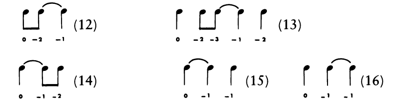

### Criticism

Same as Lerdahl & Jackendoff 1984. However, the syncopation / note weight theory is measurable, not like the MWFR and MPR of GTTM.

## Povel & Essens 1985

**Perception of temporal patterns**

Listeners have internal clocks. The suggested clock has unit length (in milliseconds), unit (the number of sub elements), and location (like phase).

Proposed algorithm _(which is very simple!)_ can find the best clock (unit and location) for a series of intervals. Assessed in experiments 1 & 2.

Discuss a way to encode the pattern by a clock into reduced representation. Generally argue that better clocks will allow more reduction in encoding. Assessed in experiment 3.

### Experiment 1

**Independent variable:** The "category" of the sequence (equivalent to the score of the best induced clock).
**Dependent variable:** The accuracy in reproducing the sequence - deviation from exact timing in milliseconds.

Results show high correlation between the category and difficulty to reproduce the sequence, suggesting that the category is a valid representation of sequence complexity.

### Experiment 2

Identical to experiment 1. Now the heard sequence was accompanied with the best fitting clock (as metronome). The results show improvement in accuracy to reproduce the sequences, confirming the assumption that internal clock is needed, and that it's the same as the one the algorithm suggests.

### Experiment 3

**Independent variable:** pairs of the same sequence with different clocks.
**Dependent variable:** participants reported which sequence + clock feels simpler.

The results supports the hypothesis that there is a preference for clocks with highly reduced encoding.

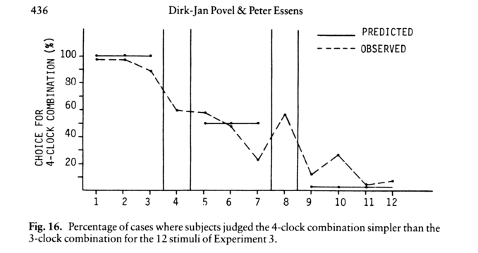

### Criticism

Although the rules for accents looks very adequate in the context of the algorithm, there is no support for this choice of rules.

Why did they choose only a subset of the stimuli for experiment 2?

Why not measuring the reproduction of the clock, especially when the same sequence have multiple clocks with same / similar score?

Other than that - really good!

## Palmer & Krumhansl 1990

**Mental representations for musical meter**

Profiles of onsets locations (aka Krumhansl & Kessler 1982) are compared in different ways: to theory, corpus analysis, etc.

### Experiment 1 - frequency distribution

Corpus analysis shows that the distribution of note onsets in a bar is highly correlated with the theoretic prediction for accent on this tick.

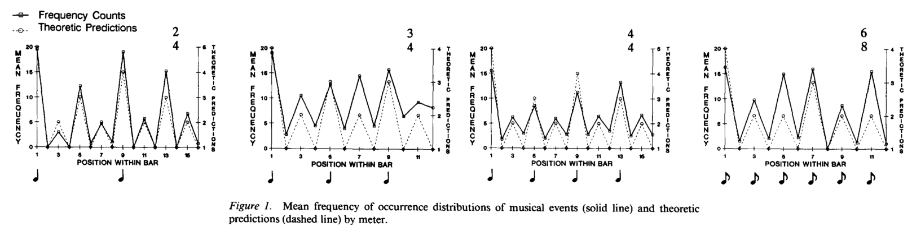

### Experiment 2 - perceptual hierarchies

**Independent variables:**

- Probe onset location within a bar. The metre is not presented, but imagined by participants. Only the first beat is heard for context.
- Musical training.

**Dependent variable:** goodness of fit of the probe onset.

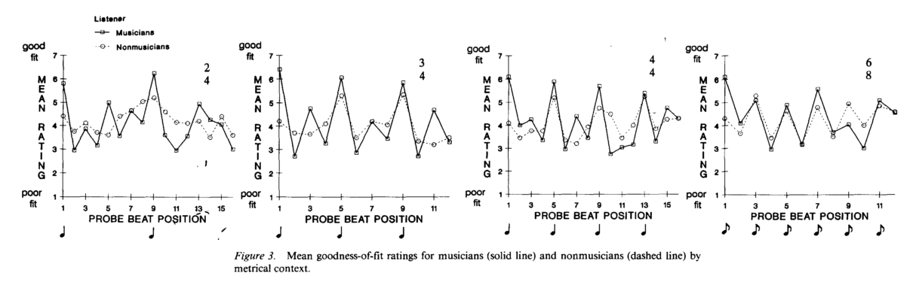

Results suggests that there is an abstract knowledge of organization of rhythm.

### Experiment 3

**Independent variable:** two probes are heard against a context. Later two more probes are heard. They can be the same or different.
**Dependent variable:** reporting the later probes as same or different.

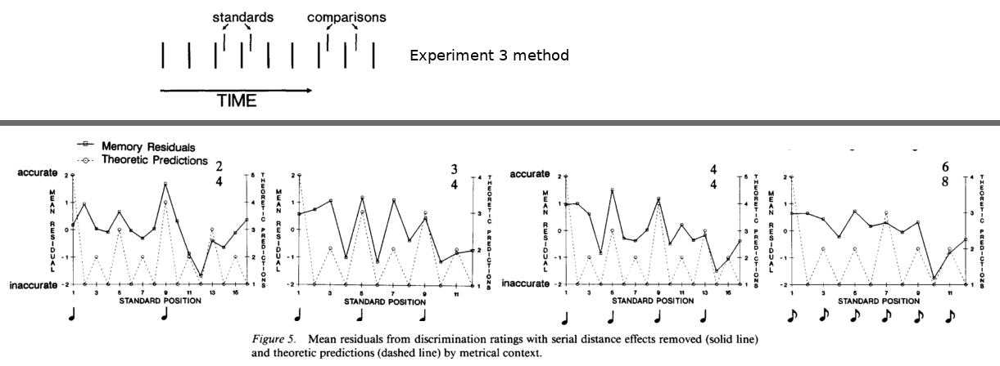

The results correlates with the expectations from theory.

### Criticism

The conclusions from experiment 2 are way too general compared to the results they've got. I can only guess that they couldn't find a significant meaning in the results.

## Drake & Palmer 1993

**Accent Structures in Music Performance**

Three types of accents: rhythmic grouping, melodic, and metric (different accent types from the 3 Lerdahl & Jackendoff 1984 suggested). The study checks how pianists use intensity, inter-onset timing, and articulation (time between offset and onset), to emphasize each type of accents when different accept types happen simultaneously / contradict with each other.

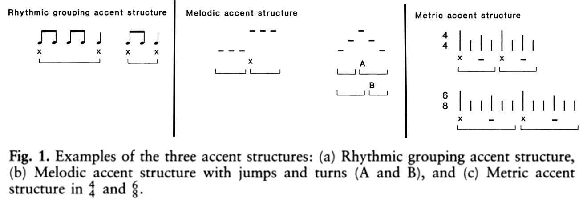

### Experiment 1

**Independent variables:**

- Sequence score for the pianist to play. Each score had only one accent type: rhythm, melody, or metre.
- Request to play mechanically or musically.

**Dependent variables:** intensity, timing, and articulation.

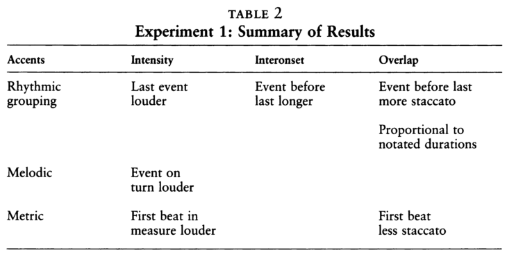

### Experiment 2

Same as experiment 1, but with scores that combine the different accent types. The results are also very similar. Rhythmic grouping accents are emphasized more when accents contradict. "...performance variations associated with the melodic accents were least stable and those associated with rhythmic grouping were most stable".

### Experiment 3

Same as before, but now with real musical material as stimuli (Beethoven sonata). Confirms the previous results.

## Jones et al. 2002

**Temporal Aspects of Stimulus-Driven Attending in Dynamic Arrays**

### Experiment 1

**Independent variables:**

- "Critical IOI" can be very short, short, expected, long, or very long (see figure).
- Pitch of "comparison" note can be the same as the "standard" note, higher or lower in 1 semitone.

Note that there were more independent variables, but their effect is minor.

**Dependent variable:** is the comparison note same as standard note, lower or higher.

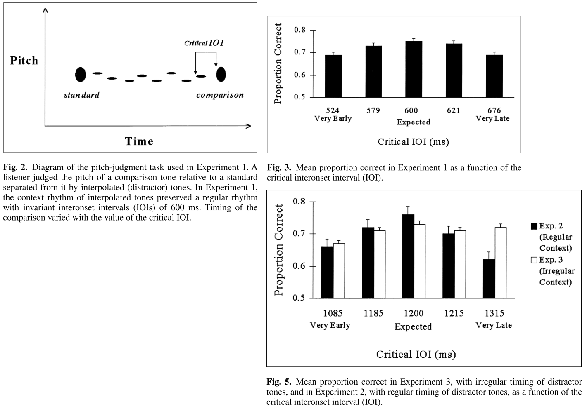

### Experiment 2

Same as experiment 1, but doubling the length of the critical IOI. Same results.

### Experiment 3

Same as experiment 2, but interpolated / distractor tones had irregular timing. For late comparison tones the percentage correct remain as high as for expected timing (which is relatively ambiguous).

## Patel et al. 2005

**The influence of metricality and modality on synchronization with a beat**

Our ability to synchronize to beat (BPS = beat perception and synchronization) is mainly a property of the auditory system.

### Experiment

**Independent variables:**

- Stimuli is auditory (beep) or visual.
- One of several different patterns: metronome, metronome with subdivisions, strongly and weakly metrical patterns from Povel & Essens 1985, and few other combinations.

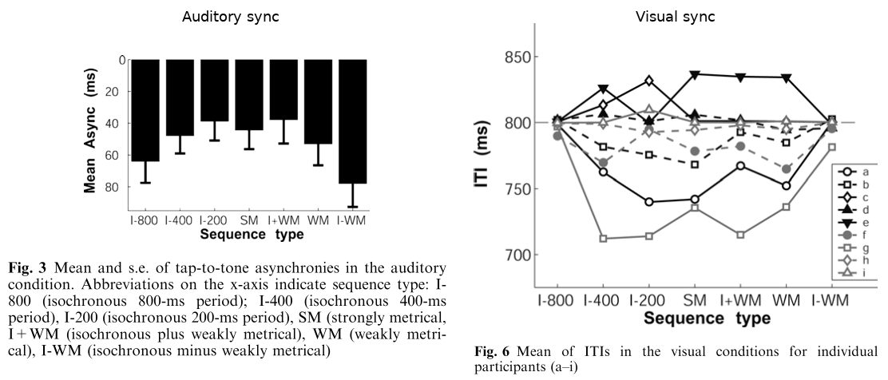

**Dependent variable:** synchronization to beat.

## Hannon & Trehub 2005a

**Metrical categories in infancy and adulthood**

### Experiment 1 - adults

**Independent variables:**

- Simple (isochronous) metre or complex (non-isochronous) metre.
- A comparison pattern that can be same (matching) or with alteration (mismatching).

**Dependent variable:** is the comparison pattern match or mismatch.

It was easy to tell when a simple metre pattern was altered. Participants failed to distinguish the alteration for patterns with complex metre.

### Experiment 2 - 6 months infants

Same as experiment 1, with few procedural differences. Mainly, infants divided into 2 groups with familiarization procedure of complex and simple metres respectively.

As opposed to the adults,the infants were able to distinguish both simple and complex metres.

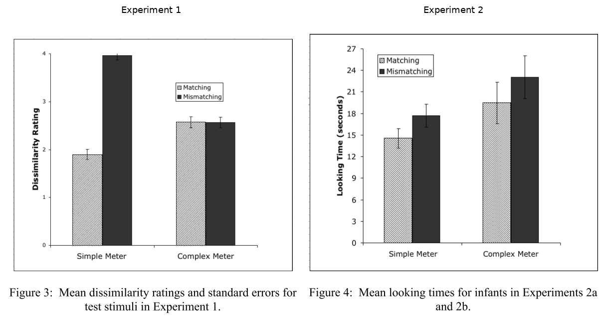

## Hannon & Trehub 2005b

Similar to previous paper.
Now, 12 months infants, that originally behave like adults (failed to discriminate violations in complex metres), can discriminate violations in complex metre after 2 weeks familiarization.
The same wasn't true for adults.

## Hannon et al. 2005

**Tuning in to Musical Rhythms: Infants Learn More Readily Than Adults**

### Experiment 1

**Participants:** 12 months infants. Compare to Hannon & Trehub 2005 experiment 2 which is the same but with 6 months infants.
**Independent variables:**

- Short familiarization phase (2 minutes) with either isochronous or non-isochronous tune.
- Re-exposure to the tune but with structure preserved or disrupted.

**Dependent variable:** infants' looking time, "which is consistent with infants' typical preference for novel stimuli".

The results are the same as Hannon & Trehub 2005 experiment 1.

### Experiment 2

Same as experiment 1, after two weeks exposure to Balkan non-isochronous music (10 minutes per day). The results show that infants are now able to distinguish structure disruption in non-isochronous metres.

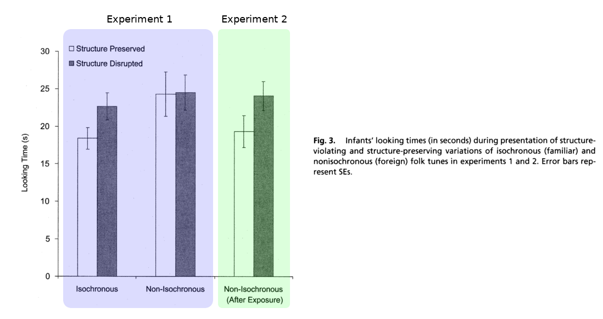

## Fitch & Rosenfeld 2007

**Perception and production of syncopated rhythms**

3 experiments that together show that:

- It is easier to tap to beat with simple rhythms.
- When the rhythm is complex there is a "reseting" of the beat to the off-beat.
- Participants remember simple rhythms better (see criticism).

### Criticism

There is no chance that the 3rd part of the experiment (rhythm recognition) really worked. It doesn't seems reasonable to ask if a rhythm occurred in a set of 30 previously heard rhythms. There most be a bias toward simple rhythms that result in the authors conclusions.

I see no contribution of this paper except cognitive confirmation the Longuet-Higgins & Lee syncopation rating algorithm.

## Iversen et al. 2008

**Perception of rhythmic grouping depends on auditory experience**

Shows that perception of long-short grouping have cultural dependencies.

### Experiment

#### Type A

**Independent variable:** sequence of notes with amplitude difference (ratios can be 1.5 or 2).
**Dependent variable:** participants perceived the sequence as "loud-soft" or "soft-loud".

No significant difference between English and Japanese speakers

#### Type B

This is almost the same, parameters changed.

**Independent variable:** sequence of notes with duration difference (ratios can be 1.25, 1.75, or 2).
**Dependent variable:** participants perceived the sequence as "short-long" or "long-short".

English speakers percept the sequences as "short-long" (known from previous literature). Japanese speakers had no preference as a group. Individuals, however, had strong preference.

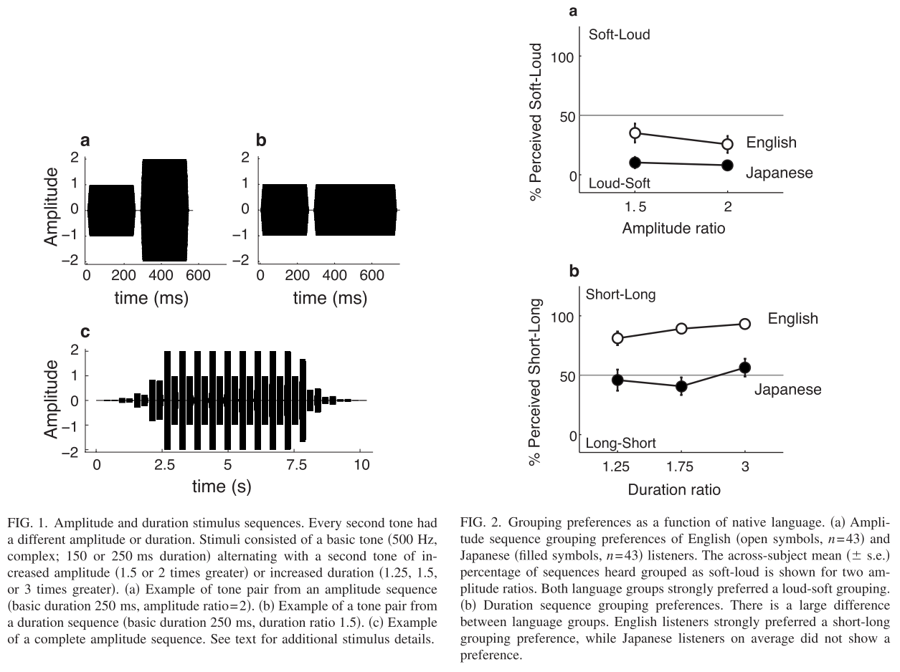

## Repp 2010

**Do metrical accents create illusory phenomenal accents?**

### Experiment

**Independent variables:**

- 3 melodic lines (heard and read from score).
- Alteration of one of the notes to have either different duration (shorter / longer) or different intensity.

**Dependent variable:** detection of the note that was altered.

Results show that participants tend to notice changes on metre accents more easily. However, there is no general bias to hear the accented positions as louder / quieter / longer / shorter.

# Tempo

## Moelants 2002

**Preferred tempo reconsidered**

Preferred tempo is located somewhere between 120 and 130 BPM. It's "related to natural movement, with humans functioning as a kind of resonating systems with a natural frequency".

Tempo data was collected through various sources:

- Online "bpm-lists".
- Participants tapping to "radio", "popular", and selected pieces in varied musical styles.

Theoretical suggestion that we have internal curve that mimics resonance curves. The "damping" argument might vary by context. For example: our tolerance to tempo variability in dance parties is lower than in a concert.

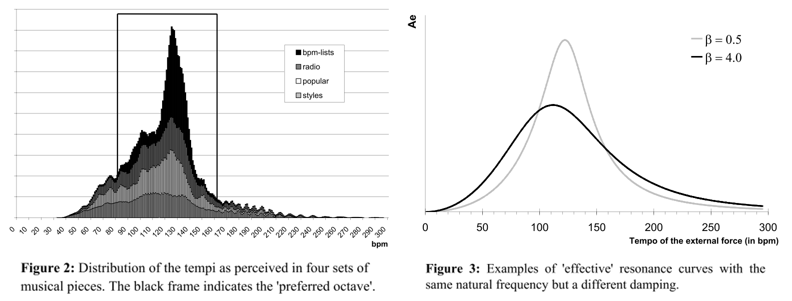

### Criticism

The selection of the data is not fully explained - which songs? why them? etc...

No stats on the fitting of the "resonance" model to the data. No model selection.

## McAuley et al. 2006

**The time of our lives: life span development of timing and event tracking**

**Entrainment:** the ability to sync to external rhythm.

Generally, creates profiles for several tapping and tempo perceptions tasks for different age groups. Includes several different experiments.

### Conclusions

- The preferred tempo (measured in period milliseconds) is positively correlated with age: young children prefer fast tempo and old adults prefer slow tempo.
- The ability to reproduce slow and fast tempo peaked for young adults. There is a decrease in performance for children and old people. In other words, the entrainment region is wider in middle years.

_I'm not understanding the "W&K", "generalized Weber law", "SET" and the rest of the models._

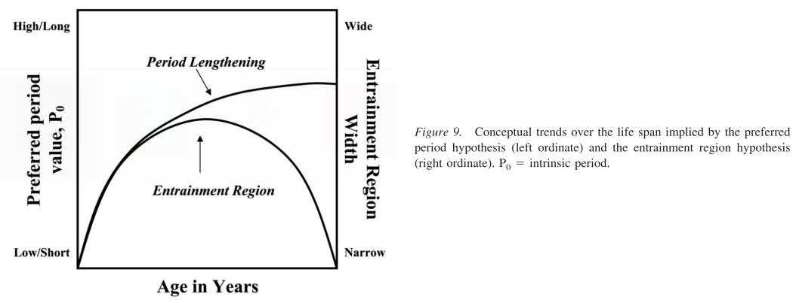

## Todd et al. 2007

**The contribution of anthropometric factors to individual differences in the perception of rhythm**

### Experiment

Presented rhythm can be perceived as "Three blind mice" (TBM), "Jingle bell" (JGB), or "William Tell overture" (WTO), depending on tempo.

**Independent variables:**

- Longest IOI.
- Sex.
- Musicianship.
- Several anthropometric properties: stature (height), mass, sitting height, biacromial breadth (width between bones above shoulders), biiliac breadth _(whatever)_, and bimalleolar breadth _(whatever)_.

**Dependent variable:** which of the tunes (names) fit the pattern best.

Than, the "preferred beat rate" is calculated as the point where the cumulative probability of JGB reach 0.5.

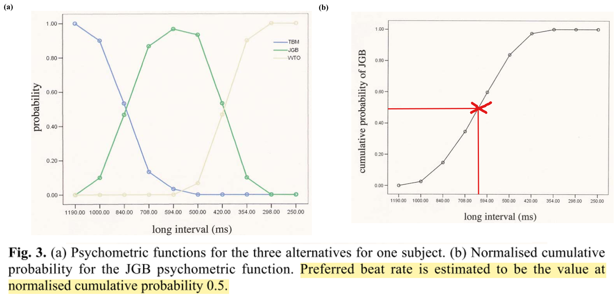

### Conclusions

Anthropometric factor contribute about 16% of the variability in preferred tempo.

### Criticism

Too much mathematical mambo-jambo. Everything seems to be correct, but they could arrive to the same results in a simpler manner.

## Dahl & Huron 2007

**The influence of body morphology on preferred dance tempos**

### Experiment

**Independent variable:** sex, height, shoulders width, legs length, weight.
**Dependent variable:** preferred tempo, adjusted by slider to be must "dancable".

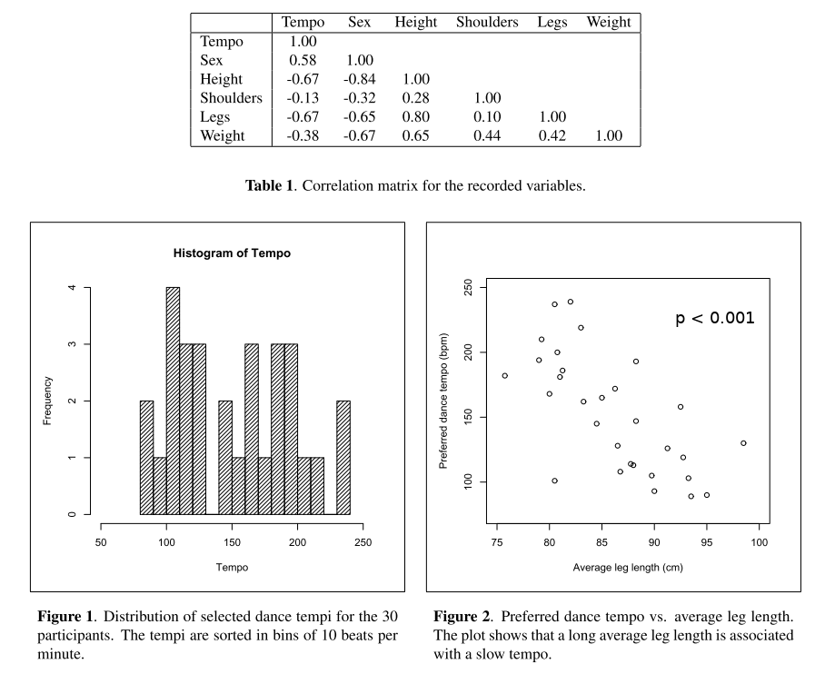

### Conclusions

The best predictor of preferred tempo is leg length (and height, which is highly correlated with leg length anyway).

**Note:** the mean preferred tempo in this study is 152.6 BPM, which is way too high and probably wrong. One reason might be that participants turned the slider to "double beat". Anyway, it doesn't affect the result much.
