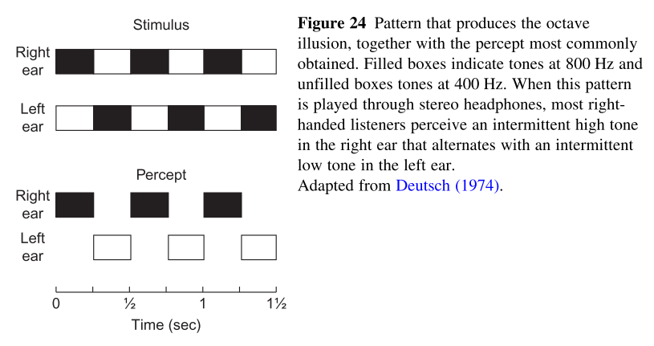
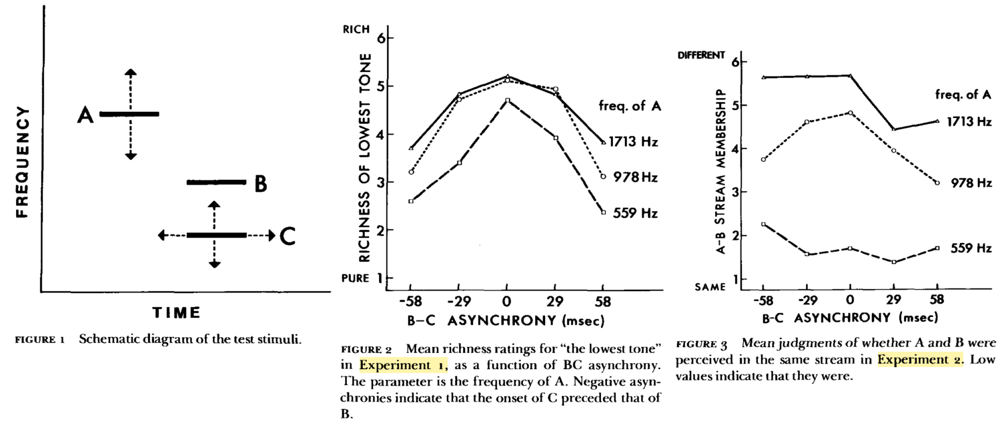
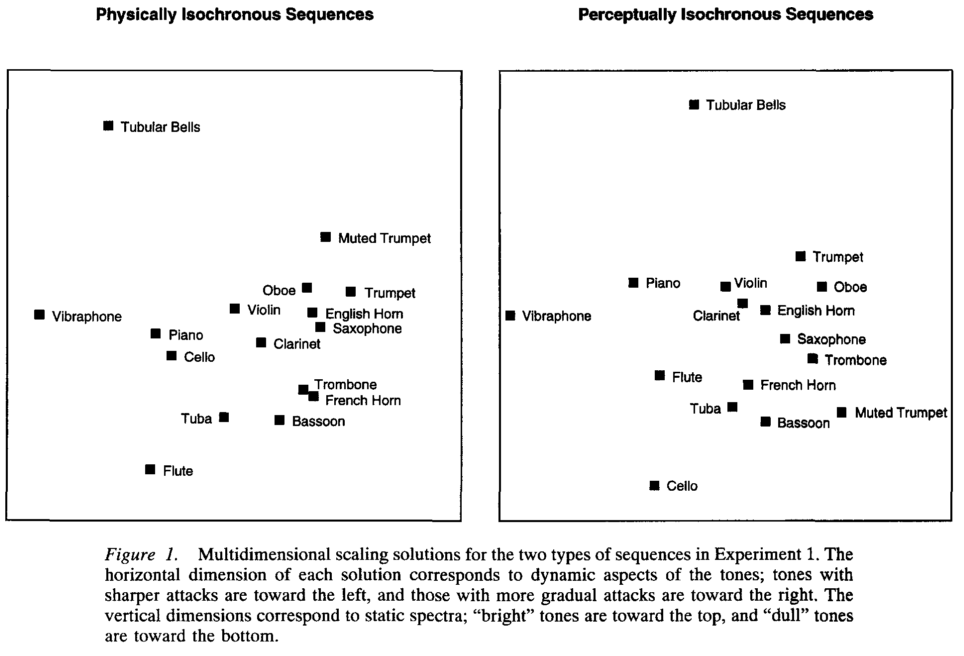
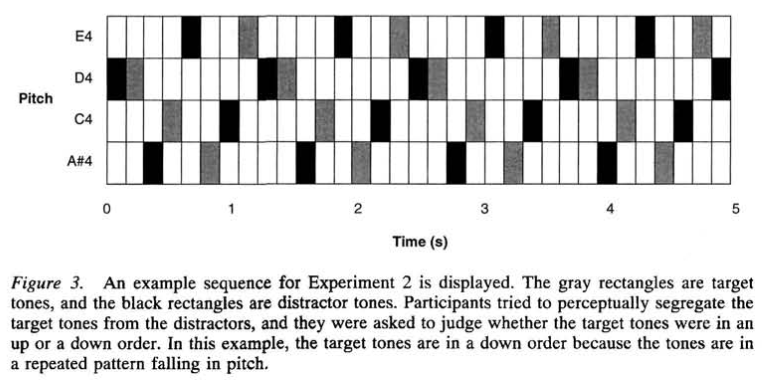
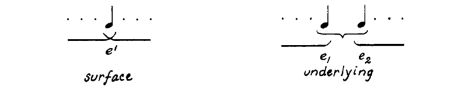
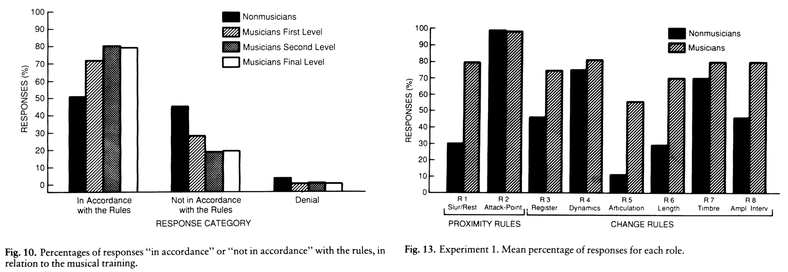
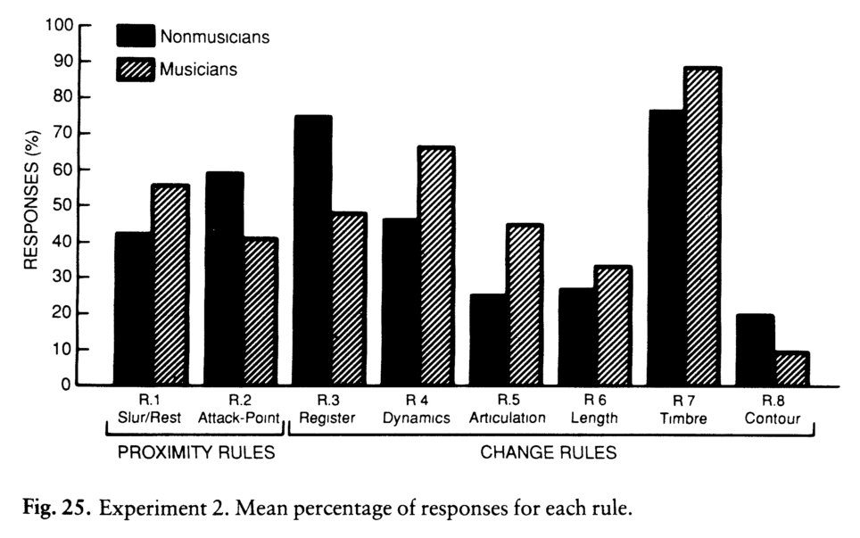
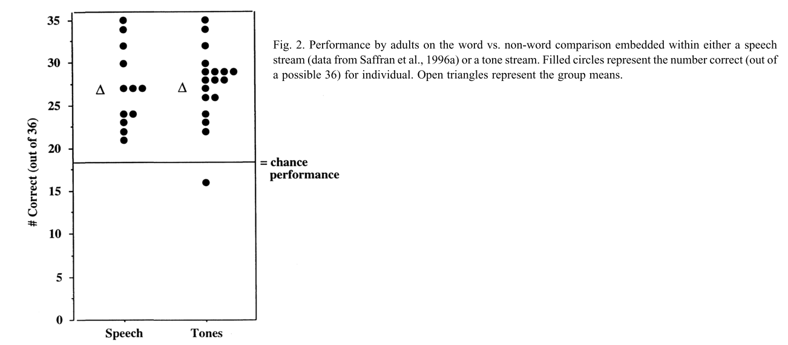
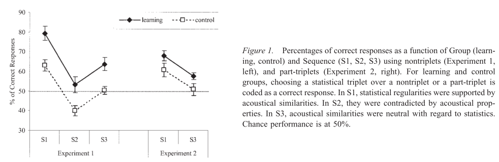

# Reviews

## Darwin 1997

**Auditory grouping**

- Interaural time-differences (the time difference between two ears), which is crucial in determining audio source location, is less important for stream segregation.
- Pure tones:
    - Miller & Heise: 15% change in frequency is enough to separate a trill of 100ms notes into 2 streams.
    - Noorden: extends the work of Miller & Heise; shows that attention control can enforce separation.
    - Bergman & Campbell: sequences of notes can break into streams depending of pitch difference; impossible to judge the temporal order of notes across streams.
- Other examples of streaming involve complex tones (the Wessel illusion), dynamics (attack duration) and changes in spatial location.
- Deutsch: grouping by fundamental frequency dominates grouping by spatial location.
- "...Continuity of timbre, pitch, and spatial location are important for maintaining the perceptual integrity of sound source over time" - Gestalt principle.

_Not as clear as Deutsch 2013._

## Deutsch 2013

**The Psychology of Music, Chapter 6**

### Complex tones

Two main ways to segregate spectral component (non-sequential): harmonicity and onset synchronicity.

- Prefer continuity whenever possible.
- Frequency modulation (vibrato) helps to fuse components together. Amplitude modulation also helps, but less.
- We are not relying on first order spatial cues (amplitude / phase / time-differences between ears). But other components can affect and "trick" our spatial recognition.
- Repetitions.

### Sequences

Processing sequential streams depends on, in descending order:

- Pitch proximity.
- Temporal proximity.
- Timbre proximity (Gestalt principle of similarity).
- Minor effect of streaming by amplitude (Van Noorden 1975), amplitude modulation (Grimault et al. 2002) and short-term memory (Roger & Bergman 1993).

Properties of sequential streaming:

- Streaming is builds up by repetitions and can be "reseted".
- Impossible to judge the temporal relationships of notes across streams (Van Noorden 1975).
- Attention can affect streaming (Van Noorden 1975, Carlyon et al. 2001 & 2003).

### Grouping monophonic melodies (musical structure - see criticism)

Most important cues for structural grouping, in descending order:

- Temporal proximity (Deliege 1987, confirming Lerdahl & Jackendoff theory).
- Pitch proximity (Deutsch 1978, Hamaoui & Deutsch 2010).

### Grouping of simultaneous tone sequences (miscellaneous effects)

- The scale illusion: very similar to the Wessel illusion when timbre is mapped to spatial information.
- The octave illusion (see figure).

### Criticism

I don't think that there is a connection between our ability to group notes to motives and phrases and our ability to separate audio sources. It is weird that the author deals with both in the same chapter.

Other researchers start from sequences of pure tones. Deutsch starts from complex tones and move to sequences - which is nice!

# Auditory Stream Segregation and Fusion

## Bergman & Campbell 1971

**Primary auditory stream segregation and perception of order in rapid sequences of tones**

### Experiment 1

Sequence of 6 pure tones of 100ms in 2 triplets, one of high freq notes and one of low freq notes.

**Independent variable:** order of 6 tones.
**Dependent variable:** ability to assign the notes labels in the correct order.

 Participants are unable to judge the temporal ordering across the streams.

### Experiment 2

Fixes experiment 1 dependency on memorizing note labels by using pattern recognition: standard loop contains 3 tones and 3 gaps. Comparison loop contains 6 notes. Participants need to judge if the standard loop is a subset of the comparison loop. Similar results.

## Dowling 1973

**The Perception of Interleaved Melodies**

### Experiment 1

Identification of interleaved pairs of familiar melodies is possible if their pitch ranges do not overlap, but difficult otherwise.

### Experiment 2

Playing a reference melody and than interleaving a "background" melody with reference or different melody. According to authors the background interferes with same-different judgments regardless of the separation of their pitch ranges, but that range separation attenuates the interference effect. Actually, the only significant effect is of pitch separation and that performance at 0 separation was better than chance.

### Experiment 3

When pitch ranges overlap, listeners can overcome the interference effect and recognize a familiar target melody if the target is pre-specified, thereby permitting them to search actively for it.

### Experiment 4

Familiarity or pre-specification of the interleaved background melody appears not to reduce its interfering effects on same-different judgments concerning unfamiliar target melodies.

### Criticism

Best abstract ever!

Check experiment 2 validity and conclusions.

## Bergman & Pinker 1978

**Auditory streaming and the building of timbre**

All experiments follow similar manipulations of the stimuli, as suggested by the figure below. Variables include the frequency of note A, the frequency of note C, and the onset synchronization of B and C. Note B frequency is 527Hz in experiments 1 & 2, 600Hz in experiments 3 & 4.

### Experiment 1

**Independent variables:**

- Frequency of note A.
- B-C asynchrony.

**Dependent variable:** richness of lowest tone.

### Experiment 2

**Independent variables:** same as in experiment 1.
**Dependent variable:** Doe's A and B stream together.

### Experiment 3

**Independent variables:**

- Frequency of note A (2 or 10.7 semitones above B).
- Synchronization between B and C (in sync or out of sync).
- Gross interval size between B and C.
- Harmonicity between B and C (consonant or dissonant).

**Dependent variable:** Doe's A and B stream together.

Surprisingly, the only significant effect is note A frequency.

### Experiment 4

**Independent variables:** same as in experiment 3.
**Dependent variable:** richness of lowest tone (same as in experiment 1).

Results support the results of experiment 1. Main effects are B-C synchronicity, A frequency, and the interaction of them.

### Criticism

It seems very unlikely that segregation is not dependent on harmonicity. Everywhere else authors claim that harmonicity of sources are crucial for us to separate sources successfully.

## Demany 1982

**Auditory stream segregation in infancy**

### Experiment 1 - adults

Judging if a pair of sequences is same or different. Pair of sequences differ by note order. If the note order was changed across streams there is no way to tell the difference.

### Experiment 2 - 7-15-week-old infants

Same as experiment 1 (same stimuli, habituation / dishabituation paradigm). Results similar to the results of experiment 1.

## Iverson 1995

**Auditory stream segregation by musical timbre: effects of static and dynamic acoustic attributes**

### Experiment 1

**Independent variables:**

- Physically isochronous spacing (the physical onsets of the notes are equally spaced), or perceptually isochronous spacing (the perceptual onsets of the notes are equally spaced).
- 6 seconds sequences of two orchestral tones (out of a set of 16 tones), interleaved, each tone of 150 milliseconds.

**Dependent variable:** ability to separate the tones into 2 stream.

The results were analysed with multi dimensional scaling (MDS) technique to 2 dimensions. In both cases (physically and perceptually spacing) the two axes found to correlate to attack time and spectral centroid.

### Experiment 2

Introducing pitch manipulations to test the effect of streaming by timbre when the pitch vary. Results suggest that PAT (perceptual attack time) affects streaming even when pitch varies.

# Sequential Grouping Perception

## Lerdahl & Jackendoff 1983

**A Generative Theory of Tonal Music, Chapter 3**

Similar to their analysis of metre: there are "grouping well-formedness" (GWFRs) and "grouping preference rules" (GPRs). Theory does not apply to polyphonic music.

### GWFRs

1. Any contiguous sequence of pitch-events, drum beats, or the like can constitute a group, and only contiguous sequences can constitute a group.
1. A piece constitutes a group.
1. A group may contain smaller groups.
1. If a group G1 contains part of a group G2, then it must contain all of G2.
1. If a group G1 contains a smaller group G2 then G1 must be exhaustively partitioned into smaller groups.

### GPRs

1. Strongly avoid small groups.
1. Proximity: expect a boundary where (a) there is a rest slur break or (b) the inter onset interval increased.
1. Change: in register, dynamics, articulation or length of notes create boundaries.
1. Intensification: where GPRs 2 and 3 agree, place a higher level boundary.
1. Symmetry: prefer grouping that creates groups of equal length.
1. Parallelism: prefer grouping that creates parallel (similar) groups.

### The problem with GWFR 4

There are several examples against GWFR 4. The authors solution is that in such cases, where there is a note that is shared between two groups, it's the "stronger" more important note masking the other one. With this interpretation, the note doesn't really belong to the two groups, only to one. There is a note that is not heard (it is masked) that was supposed to be part of the other group (see figure).

### The role of the performer

The performer can affect grouping using GPR 2, 3, and 4. The rest are typically inherent to the composition.

## Deliege 1987

**Grouping conditions in listening to music: An approach to Lerdahl & Jackendoff's grouping preference rules**

### Experiment 1

Participants requested to segment heard musical phrase taken from classical repertoire.

**Independent variables:**

- Level of musicianship: non musician, musician level 1, 2, and 3. Musicians groups are same size, based on knowledge in harmony.
- Reported segmentation.

**Dependent variable:** reported segmentation comply with the rules.

All groups performed significantly above chance. Musicians performed significantly better than non musicians.

### Experiment 2

Analysis of preference rules when they conflict. Mostly similar to experiment 1. Stimuli was changed to specially composed sequences presenting conflicts between each pair of preference rules.

## Frankland & Cohen 2004

**Parsing of Melody: Quantification and Testing of the Local Grouping Rules of Lerdahl and Jackendoff's A Generative Theory of Tonal Music**

Two experiments address the role of Lerdahl & Jackendoff GPRs with familiar and unfamiliar nursery-rhymes and classical tonal melodies. Participants had varied musical experience (independent variable).

### Results

- Musical training affect melody parsing only for unfamiliar tonal music.
- Only GPRs 2a and 2b (temporal proximity) are significant in parsing of a melody.
- Minor effect of GPRs 3a (register change) and 3d (length change).

Overall, results doesn't comply with theory.

_Another great abstract!!!_

# Statistical Learning of Grouping Structure

## Saffran et al. 1999

**Statistical learning of tone sequences by human infants and adults**

### Experiment 1

11 chromatic 1/3 second pure tones are syllables. For each of 2 languages 6 "tone words" are created, each one from 3 syllables. 6 sentences are composed from 18 words each. These are concatenated to create 7 minute "tone story" for each language. Note that there is no mark for word / sentence boundary!

After listening to the "tone story" 3 times, each participant...

**Independent variable:** listening to 36 pairs of words, one from the language and one not.
**Dependent:** which one was from the language.

### Experiment 2

Similar to experiment 1. The non-words are now drawn from a language that all of it's words are part-words of the language that used for training. A part-word is a word from the language when it's first syllable or last syllable was changed. The results are very similar to the results of experiment 1. Less extreme but still significant.

### Experiment 3

Similar to experiment 1 but with 8-month-old infants. Same results.

### Conclusions

All experiments show results very similar to those of learning spoken languages.

_Amazing!_

## Tillmann & McAdams 2004

**Implicit learning of musical timbre sequences: statistical regularities confronted with acoustical (dis)similarities**

Very similar to Saffran et al. 1999 but with "timbre" based words, instead of pitches. There are also methodological differences. The results support the idea that we have statistical learning of musical words.

### Experiment 1

13 timbres from McAdams et al. 1995 create 18 words of 3 timbres each. Each word belong to one of the following groups: (S1) similar timbre, (S2) different timbre, or (S3) neutral timbre. Participants divided into 2 groups: control and "learning". The learning group listened to 3 x 11 minutes of word sequences. The control group didn't.

**Independent variables:**

- Participant group.
- Pair of a word and non-word. The variable is the type (S1 / S2 / S3) of the word.

**Dependent variable:** percentage correct of choosing the word over the non-word.

.

### Experiment 2

Same as experiment 1. Now, instead of words vs. non-words, it's words vs. part-words (see Saffran et al. 1999).

### Criticism

- Why S2 is missing from experiment 2?
- Control group didn't listen to anything before testing phase, and got different instructions compared to learning group.
