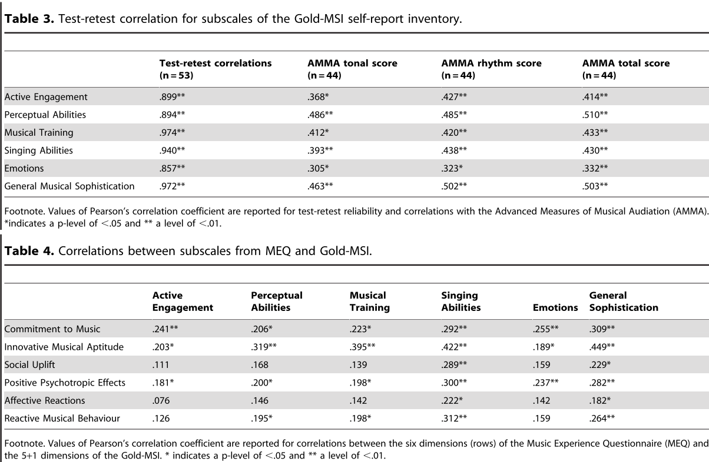
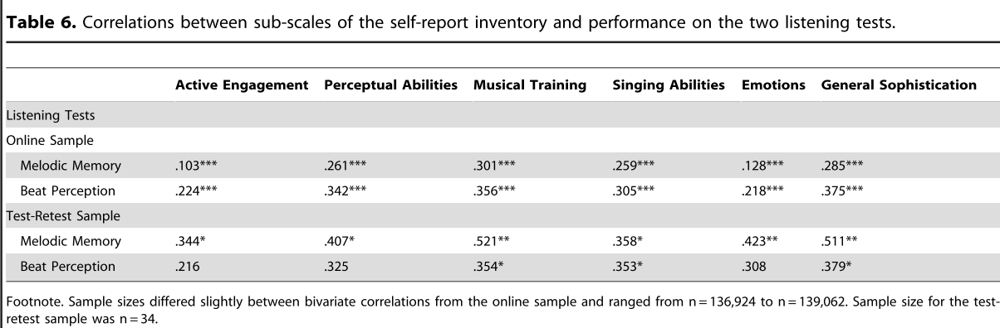
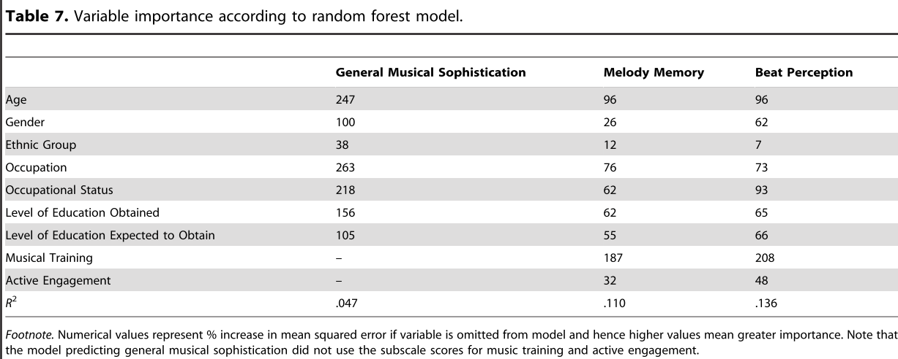
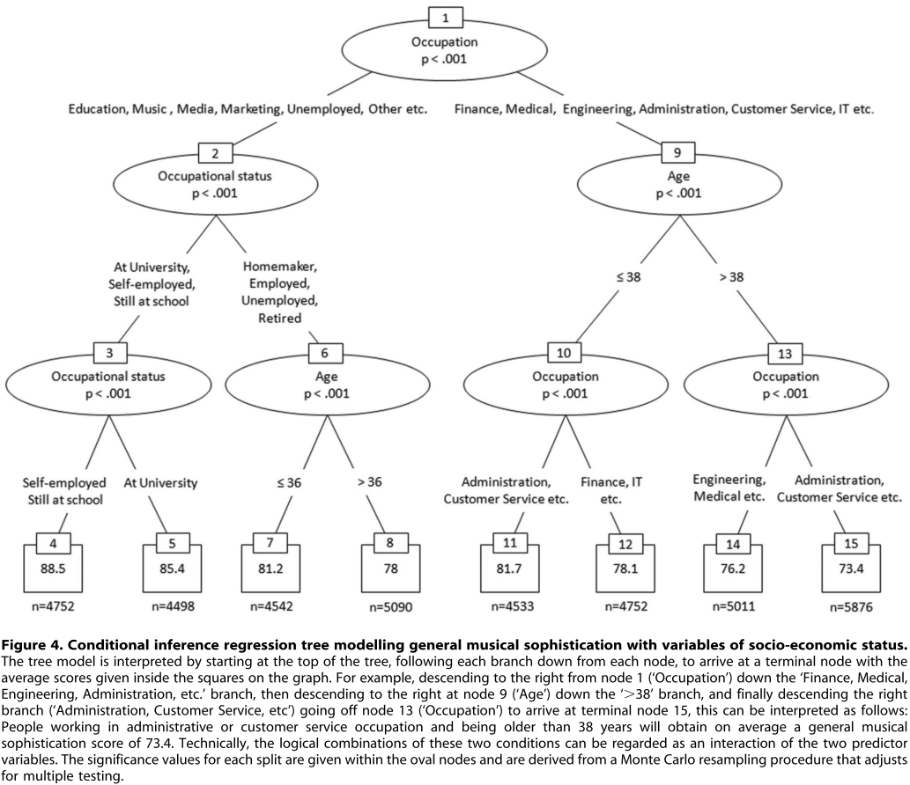

# Musical training

## Vuust et al. 2011

**New fast mismatch negativity paradigm for determining the neural prerequisites for musical ability**

### Experiment

**Independent variables:** 6 deviations (pitch, timbre, spatial location, intensity, slide and rhythm) in [Alberti bass](https://en.wikipedia.org/wiki/Alberti_bass) lines.
**Dependent variable:** EEG MMNs.

Results show high correlation between MMNs and deviations. Compared to previous studies the procedure here is much faster - only 20 minutes, covering 6 different auditory measurements in musical context.

### Criticism

Apart from implementing the test to be faster, there is nothing new here. [Koelsch et al. 1999](http://www.stefan-koelsch.de/papers/nr100629.pdf) claim to be the first to show correlation between musicianship and MMNs. The current paper cite it but use a different method that was not confirmed. More specifically:

- The experiment doesn't show a correlation between MMNs to musicianship.
- There is no comparison to other, behavioral, musicianship tests (not here and hot in Koelsch et al. 1999).

## Müllensiefen et al. 2014

**The musicality of non-musicians: An index for assessing musical sophistication in the general population**

Propose a multidimensional musical sophistication test, the Gold-MSI.

### Experiments 1 and 2

Experiment 1 and 2 share the same data set, collected from ~140K (!!!) online surveys. They were divided to two halves, one for experiment 1 to create a model and the 2nd for model validation in experiment 2.

70-item self reported questionnaire. Factor analysis of the results suggest 5 relevant factors of musical sophistication: active engagement, perceptual abilities, musical training, singing abilities and emotions.

### Experiment 3

Assess correlation between Gold-MSI and other tests (see figure).

### Experiment 4

Assess correlation between Gold-MSI and musical ability using melodic memory and beat perception behavioral tests.

### Experiment 5

Find correlations between socio-demographic conditions and musical sophistication (see figures and criticism).

### Criticism

Experiment 1 data analysis seems to be too complex, suggesting that they couldn't find a meaning in the data, resulting in too much transformations to get significance.

The trees resulted from experiment 5 shows errors in the analysis. Regression trees shouldn't include repeated factors.

# Attention

## Dalton & Hughes 2014

**Auditory attentional capture: Implicit and explicit approaches**

A review.

- Implicit approach, using reaction time (RT)-based oddball paradigm. Conclusions:
    - The distraction cause the initiation of the auditory processing to delay.
    - When the distraction is speech we involuntarily semantically analysing it.
- Explicit approach. "Inattentional blindness" (failing to notice the gorilla when instructed to count ball passes). Examples:
    - Playing letters to one ear instructing to count "A" occurrences. Participants failed to notice events on the other ear.
    - Crossmodal variations show inability to notice auditory event when forcing to pay attention to visual stimuli.
    - Failure to notice a man shouting "I'm a gorilla" when instructed to concentrate on women talk in a multi conversation audio-only environment.
    - Inherent drawback: each participant can only be asked one about the distraction.

Theories:

- Expectancy violation.
    - Supportive evidence include the fact that pre-warning participants about the distraction changes the results.
- Level and type of task engagement.
    - For example, "explicitly measured attentional capture by an unexpected auditory tone was reduced by increases in the perceptual demands of a concurrent visual discrimination task".
- Auditory versus visual attentional capture mechanisms.
    - Spatial vs. sequential.
    - Audio attention capture theories and experiments focus on "expectancy, prediction, and novelty detection".
- Top down vs. stimulus driven processing.

### Criticism

Hard to read. Ideas looks generally simple but their presentation in not clear.

Lots of the referenced papers discuss speech processing. Speech is processed differently than "general audio stimulus". What are the differences?

## Spielmann et al. 2014

**Attention effects on auditory scene analysis: Insights from event-related brain potentials**

Propose a method to analyse both stream segregation and stream fusion in the same time using ERP / MMNs measures. Use this approach to manipulate attention capture by changing streaming and fusing properties.

_Complex neuroscience. Didn't read._
