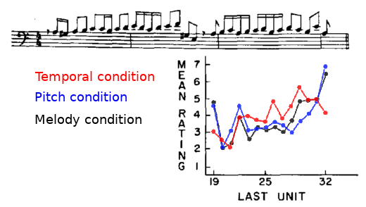

# General

## Huron 2006

**Sweet anticipation: Music and the Psychology of Expectation**

### Chapter 1 - Introduction and the **ITPRA** theory

A set of psychological systems build crucial expectations for anticipating the future. The systems are divided into pre-outcome and post-outcome responses.

### Chapter 2 - Surprise

In absolute surprise only the post-outcome reactions take place. There are no predictions, so there is a punishment for mis-reading the future correctly. The reaction response usually prepare the system for worst case scenario ("boo!"). However, the appraisal response can take different forms, and may be positive. For example, subjects of surprise parties are firstly horrified. After a few seconds, when the appraisal phase starts, they enjoy it.

"Surprise acts as an emotional amplifier". Musical surprises are correlated to the known fight / flight / freeze response from nature. The difference is that the appraisal phase attenuate the fear from the unknown and transform the feeling to frisson / laughter / awe correspondingly.

### Chapter 3 - Methods for measuring musical expectation

1. **Tone detection method**- participants report if they hear a tone. Greenberg & Larkin: low amplitude tone is played in specific pitch and time, masked with white noise. Participants expecting the tone were able to notice it more easily.
1. **Production method**- e.g. participants sing / play / compose a continuation for an interrupted tune. Disadvantages: requires singing / playing / etc. and sometime improvisation ability. Advantages: study long-term expectations.
1. **Probe-tone method**- a la Krumhansl. Disadvantages: tedious (partly solved with Shepard tones). Derivatives: **(a) Progressive prob-tone**- e.g. first 3 notes of a melody are played, 4th note probed and measured for goodness of fit. Than first 4 notes and a prob and so on. Even more tedious. **(b) Continuous prob-tone**- the probe stays and the context varies. Less tedious but less accurate.
1. **Betting paradigm**- similar to prob-tone but instead of probe and goodness of fit participants get poker chips and have to bet on the most probable continuation to maximize winnings. Disadvantages: tedious and learning effect.
1. **Head turning paradigm**.
1. **Bradycardic response method**- similar to head turning paradigm with measuring heart rate instead. Like head turning paradigm, "each trial gives comparatively little information, and building a picture of infant expectation may require hundreds of trials from dozens of participants".
1. **Reaction time method**- "When you hear an expected sound, you will typically be able to process it more quickly and respond to it faster". Advantages: can be used continuously, without interruptions to the music (except from slowing the tempo down to make the task possible), and therefore faster than other methods. Drawbacks compared to probe-tone and betting paradigms: no data collection for all possibilities and no way to tell the exact cause of the reaction time difference.
1. **Evoked response potential (ERP) and the derived mismatch negativity (MMN)**.

### Chapter 4 - Auditory learning

Auditory expectations are learned, not innate. The main purpose of the chapter is to support this argument.

"Both instincts and learning are the products of biological evolution. From a biological perspective, there is a clear criterion for when it is best for a behavior to be instinctive and when it is best for a behavior to be learned. The critical determining factor is the stability of the environment... An evolved capacity to learn is consequently referred to as **the Baldwin effect**".

**The Hick–Hyman law**- there is a correlation between stimuli frequency and reaction time: "processing of familiar stimuli is faster than processing of unfamiliar stimuli".

See statistical learning references in week's 5 notes.

### Chapter 5 - Statistical properties of music

- "There is a tendency to construct melodies consisting mostly of small pitch movements" (based on repertoire).
- "Large melodic intervals are more likely to ascend and that small melodic intervals are more likely to descend". Equivalently, because melodies are bounded in pitch "we might simply say that the majority of melodic movements are descending small intervals". This was replicated cross culturally. Similar phenomenon presents in speech.
- **Descending step inertia**- "small pitch intervals (1 or 2 semitones) tend to be followed by pitches that continue in the same direction".
- "Large intervals tend to be followed by a change of direction".
- **Melodic arch**- "a general tendency for phrases to rise upward and then descend in pitch".

### Chapter 6 - Heuristic listening

Recap chapter 5 and present the perceptual equivalents. Simplified **implication-realization theory** suggests that two rules have the most predictive power:

1. **Pitch proximity**- listeners expect an ensuing pitch to be near the current pitch.
2. **Post-skip reversal**- listeners expect a large interval to be followed by a change in pitch direction.

There are major differences between the statistical properties of music and listeners expectations. We do systematic errors in expecting regression to the mean, descending step tendency and melodic arches. The question arises: "Why are listeners so imperfect in their musical expectations?".

### Chapter 9 - Tonality (restricted to the qualia of scale degrees)

- Shared descriptions of scale degrees for musicians and non musicians.
- Statistical learning can explain most of the qualias. First order probabilities explain "stability", 2nd order can explain "raise" and "fall" tenancy. There are several more examples.
- Two similar profiles: statistical occurrences of scale degrees and the profiles of Krumhansl & Kesler (1982). Are aren't they exactly the same? For example, according to Krumhansl & Kesler the tonic is more stable than the 5th, but it less statistical probable in the repertoire. Possible answer: the Krumhansl & Kesler profiles are for closing phrases.
- "Listeners are sensitive to the scale-degree distribution at points of interruption or closure". "Phrase endings exhibit scale-degree patterns that have a comparatively high probability of occurrence". "Cadences are both melodically and harmonically more predictable than other segments of the music". The first event after a cadence is usually unpredicted (after a series of more predicted moves).
- First order Markov chain can explain both feeling of tendency and of closure. "The qualia of pleasure appears to be a direct consequence of learned high probability events". Therefore, tendency and closure are part of the tension response, whereas pleasure is part of the prediction response.
- Few cross-cultural studies support the idea that tone qualia can be found in any musical culture, as it the result of statistical learning.

### Chapter 10 - Expectations in time

- Periodic events are the most easily anticipated. What are the required characteristics of a period to be expected? Most researchers explore beat tracking and found the optimum around 80-100 BPM.
- "Listeners attention is most acute at strong metric positions".
- Zero order influences:
    - Relationship between expectancy to metre hierarchies.
    - **Hypermetre**- when multiple bars are observed and hierarchies emerged accross the bars.
- High order dependencies between events in time are presented in language, where there are strong dependencies between close characters but less when the characters are far apart. Similar phenomena, but more complex, exists in music (_but it relate to pitch, why is it here?_).

# Melodic expectation

# Harmonic expectation

# Temporal expectation

## Jones 1987

**Dynamic pattern structure in music: Recent theory and research**

**Dynamic pattern structure** refers to the ways in which rhythm and melody combine to create **joint accent structure**. It can be used to understand similarity and simplicity of musical patterns.

## Palmer & Krumhansl 1987a

**Independent Temporal and Pitch Structures in Determination of Musical Phrases**

### Experiment 1

Measuring judgment of completeness of temporal only, pitch only, and melody (temporal + pitch).

**Independent variables:**

- Stimuli type (temporal, pitch, or melody).
- Ending note.

**Dependent variable:** judgment of completeness on a scale of 1 to 7 (a la Krumhansl).

Main effect for ending note. No main effect for stimuli type. Significant interaction between variables, "indicating different effects of pitch and temporal information". Significant correlation between melody and other stimuli types. No correlation between temporal and pitch conditions.

Surprisingly, melodic rating profile can be derived algorithmically from two simpler profiles with linear regression!

### Experiment 2

Instead of separating the conditions as in experiment 1 they anchored one condition and shifted the other with all possible shifts. Results were collapsed around non shifted condition (see figure).

Supports the results of experiment 1.

_Really really nice! Why the linear combination coefficients are not presented? they might be interesting. Should be reproduced with more diverse musical material._

## Palmer & Krumhansl 1987b

**Pitch and temporal contributions to musical phrase perception: Effects of harmony, performance timing, and familiarity**

Very similar to Palmer & Krumhansl 1987a.

**Differences:**

- New musical excerpt (Mozart K. 331 piano sonata), now includes harmonic part.
- Familiarity with the musical excerpt taken into account (new independent variable).
- Analysis of correlations with tonal predictions from Krumhansl & Kesler 1982.
- Analysis of correlations with metrical accent predictions from Lerdahl & Jackendoff 1983.
- Analysis of correlations with time-span (grouping) predictions from Lerdahl & Jackendoff.

### Experiment 1

The results of Palmer & Krumhansl 1987a experiment 1 were replicated. In addition:

- For familiar listeners pitch and temporal conditions correlate.
- Tonal predictions are highly correlated with pitch and combined conditions.
- Metrical accent predictions are highly correlated with temporal and combined condition for unfamiliar listeners and with temporal condition for familiar listeners.
- Time-span predictions are highly correlated with combined condition.

### Experiment 2

The results of Palmer & Krumhansl 1987a experiment 2 were replicated with one minor difference - temporal condition response is now correlated with pitch condition response. In addition:

- Tonal predictions are highly correlated only with pitch condition for familiar listeners.
- Metrical predictions are highly correlated with temporal and combined conditions.
- Time-span predictions are highly correlated with combined condition.

### Experiments 3 & 4

Same as experiments 1 & 2 but with live performance durations. Generally, got the same results. Correlations with predictions varied.

### Conclusions

As in Palmer & Krumhansl 1987a, with minor addition: "the relationship between pitch and temporal components differed with familiarity with the music... When one component was presented without the other, listeners familiar with the excerpt reported imagery for the missing component and tended to have higher correlations between pitch and temporal ratings than did listeners unfamiliar with the excerpt".

### Criticism

No explanations why correlations with predictions got different significance between experiments.

About stats: the authors conclude that all experiments support the same general ideas. If they were collapsing the data across experiments they will get much less significance between predictions and data, but the significant correlations will be more reliable. In general, it look like they measure significance of each correlation by it own, without balancing the measurements.

This study is more complicated than 1987a and therefore introduce more issue. Thereby, 1987a looks nicer, but maybe it's just the simplicity. Overall, 1987b have no major added value.

## Boltz 1989

**Time judgments of musical endings: Effects of expectancies on the "filled interval effect"**

### Experiment 1

Pairs of melodies were played. Several independent variables had no effect, so they were ignored here.

**(significant) independent variable:** type of pair endings (tonic-tonic, leading tone-leading tone, or tonic-leading tone).
**Dependent variable:** judgment which of the two has longer duration.

Found that a melodies that ends on the leading tone sounds shorter than those that ends on the tonic.

### Experiment 2

Similar to experiment 1 with more independent variables.

**New independent variable:** ending note accent timing can vary (invariant, accent early, or accent late), for each item in the pair.

Confirms the results of experiment 1 and add that early accent on the ending note result in judging the melody as shorter. _OK, that's true! the melody **is** shorter because accents are the most significant temporal property._

## Palmer & Krumhansl 1990 _see week 4 notes_

## Jones et al. 2002 _see week 4 notes_

# Expectation and emotion

## Egermann et al. 2013

**Probabilistic models of expectation violation predict psychophysiological emotional responses to live concert music**

### Hypotheses

- Information-theoretic analysis could predict whether participants perceived particular musical segments as expected or unexpected.
- High information content (IC) peaks could predict subjective reported valance / arousal and physiological measurements (skin conductance, heart rate, perspiration rate, facial EMG).
- Self reported uncertainty could predict the same.

### Experiment

50 participants listening to 6 pieces in a concert. Results show:

- Extreme IC values (high / low) predict reported expectancy.
- Extremely high IC predict arousal and valance. Partially effect on physiological measures.
- High levels of unexpectedness had similar effect as high IC.
